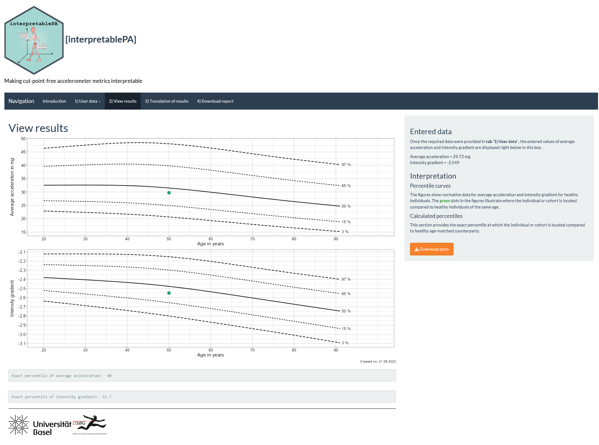

Interpreting cut-point-free accelerometer data using interpretablePA
================

-   [Project description](#project-description)
    -   [Target audience](#target-audience)
    -   [Practical application](#practical-application)
-   [Installation](#installation)
-   [Examples](#examples)
-   [Contact](#contact)
-   [Session info](#session-info)
-   [License](#license)

<p align="right">


</p>

[](https://doi.org/10.1101/2023.04.19.23288786)

## Project description

### Target audience

`interpretablePA` was created for researchers and clinicians interested
in measuring human movement using raw-acceleration accelerometers in
various populations or individuals.

### Practical application

This package supports the use of cut-point-free accelerometer metrics,
namely daily average acceleration (AvAcc) and intensity gradient (IG),
to assess physical activity. AvAcc and IG have been shown to be a viable
alternative to traditional metrics and are strongly related to various
health outcomes.

The `interpretablePA` package contains an application that can classify
physical activity levels based on age- and sex-specific reference values
and translate cut-point-free accelerometer metrics into meaningful
outcomes. Reference values are based on a population sample of 463
healthy adults aged 20 to 89 years in Switzerland who wore the GENEActiv
on their non-dominant wrist for up to 14 days.

`interpretablePA` requires data processed using the R-package GGIR in a
similar manner. GGIR supports the processing of multi-day raw
accelerometer data for physical activity and sleep research. See the
GGIR package
[vignette](https://cran.r-project.org/web/packages/GGIR/vignettes/GGIR.html)
for further information.

## Installation

You can install the package from GitHub by typing the following:

``` r
install.packages("remotes")

remotes::install_github("FSchwendinger/interpretablePA")
```

After installation, load it in R using `library(interpretablePA)` and
start the application by running `interpret.pa()`.

## Examples

The below images will give you some insights into the package. A typical
workflow could be:

1.  The user run installs and loads `interpretablePA` and runs
    `interpret.pa()`. This starts the application.

2.  The user decides what data format they want to enter (data of an
    individual, pooled means/medians of a whole study cohort that are
    stratified by sex or not, or data of several individuals with sample
    size = N) and selects the respective option under panel “*1) User
    data*”.

3.  Assuming the user decides to enter data of one individual (see
    Figure 1), they would fill in all the fields, i.e. sex, age, height,
    body weight, average acceleration, and intensity gradient; then
    press “Calculate”.

    **Figure 1.** One of three data entry options the user can utilize.

    

4.  Panels “2) View results” (see Figure 2) and “3) Translation of
    results” (see Figure 3) are now accessible.

5.  The user can find out the exact percentile the individual is on
    compared to our reference values and download centile plots.

    **Figure 2.** Example of graphical output. Green dots are the data
    entered by the user.

    

6.  In panel “3) Translation of results”, the user is provided with
    information on a) what is necessary for the individual to reach the
    50th percentile or increase their physical activity by 5%, b) which
    changes would be needed to achieve a clinically relevant improvement
    in cardiorespiratory fitness, and c) how much more physical activity
    would need to be performed to reduce the risk of death and disease.

**Figure 3.** Example of the translation of results.


## Contact

If you are interested in contributing or have any queries regarding this
package, feel free to reach out to:

[Fabian
Schwendinger](https://dsbg.unibas.ch/de/personen/fabian-schwendinger/)

## Session info

    ## R version 4.1.0 (2021-05-18)
    ## Platform: x86_64-w64-mingw32/x64 (64-bit)
    ## Running under: Windows 10 x64 (build 19044)
    ## 
    ## Matrix products: default
    ## 
    ## locale:
    ## [1] LC_COLLATE=English_United Kingdom.1252 
    ## [2] LC_CTYPE=English_United Kingdom.1252   
    ## [3] LC_MONETARY=English_United Kingdom.1252
    ## [4] LC_NUMERIC=C                           
    ## [5] LC_TIME=English_United Kingdom.1252    
    ## 
    ## attached base packages:
    ## [1] stats     graphics  grDevices utils     datasets  methods   base     
    ## 
    ## loaded via a namespace (and not attached):
    ##  [1] compiler_4.1.0  fastmap_1.1.1   cli_3.6.1       tools_4.1.0    
    ##  [5] htmltools_0.5.5 rstudioapi_0.14 yaml_2.3.7      rmarkdown_2.21 
    ##  [9] knitr_1.42      xfun_0.38       digest_0.6.31   rlang_1.1.0    
    ## [13] evaluate_0.20

## License

[](https://www.gnu.org/licenses/gpl-3.0)
