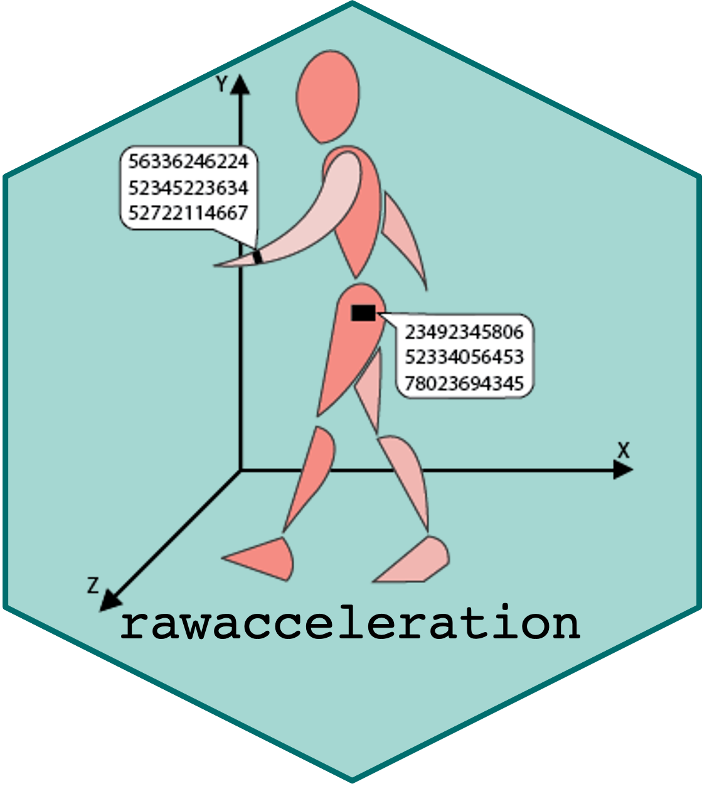
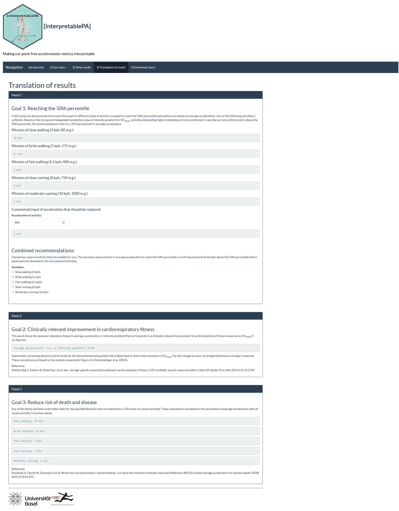

Interpreting cut-point-free accelerometer data using interpretablePA
================

- [Project description](#project-description)
  - [Target audience](#target-audience)
  - [Practical application](#practical-application)
  - [Reference populations](#reference-populations)
- [Installation](#installation)
- [Applications and Usage](#applications-and-usage)
  - [1. `interpret.pa()` – Shiny app for adult
    data](#1-interpretpa--shiny-app-for-adult-data)
  - [Examples](#examples)
  - [2. `interpret.pa.centiles()` – Function for children’s and adult
    data](#2-interpretpacentiles--function-for-childrens-and-adult-data)
- [References](#references)
- [Contact](#contact)
- [Session info](#session-info)
- [License](#license)

<p align="right">



</p>

[](https://doi.org/10.1101/2023.04.19.23288786)

## Project description

### Target audience

`interpretablePA` was created for researchers and clinicians interested
in measuring human movement using raw-acceleration accelerometers in
various populations or individuals.

### Practical application

This package supports the use of cut-point-free accelerometer metrics,
namely daily average acceleration (AvAcc) and intensity gradient (IG),
to assess physical activity. AvAcc and IG have been shown to be a viable
alternative to traditional metrics and are strongly related to various
health outcomes.

### Reference populations

The package provides:

- A Shiny application for interpreting adult data, based on reference
  values from a Swiss population (ages 20–89)

- A function for interpreting children’s data, using reference values
  from an English youth cohort

`interpretablePA` requires data processed using the R-package GGIR in a
similar manner. GGIR supports the processing of multi-day raw
accelerometer data for physical activity and sleep research. See the
GGIR package
[vignette](https://cran.r-project.org/web/packages/GGIR/vignettes/GGIR.html)
for further information.

## Installation

You can install the package from GitHub by typing the following:

``` r
install.packages("remotes")

remotes::install_github("FSchwendinger/interpretablePA")
```

## Applications and Usage

### 1. `interpret.pa()` – Shiny app for adult data

The main entry point is the `interpret.pa()` function, which launches a
Shiny application to interactively interpret accelerometer data in
adults.

Typical use:

``` r
interpretablePA::interpret.pa()
```

### Examples

The below images will give you some insights into the package. A typical
workflow could be:

1.  The user run installs and loads `interpretablePA` and runs
    `interpret.pa()`. This starts the application.

2.  The user decides what data format they want to enter (data of an
    individual, pooled means/medians of a whole study cohort that are
    stratified by sex or not, or data of several individuals with sample
    size = N) and selects the respective option under panel “*1) User
    data*”.

3.  Assuming the user decides to enter data of one individual (see
    Figure 1), they would fill in all the fields, i.e. sex, age, height,
    body weight, average acceleration, and intensity gradient; then
    press “Calculate”.

    **Figure 1.** One of three data entry options the user can utilize.

    

4.  Panels “2) View results” (see Figure 2) and “3) Translation of
    results” (see Figure 3) are now accessible.

5.  The user can find out the exact percentile the individual is on
    compared to our reference values and download centile plots.

    **Figure 2.** Example of graphical output. Green dots are the data
    entered by the user.

    

6.  In panel “3) Translation of results”, the user is provided with
    information on a) what is necessary for the individual to reach the
    50th percentile or increase their physical activity by 5%, b) which
    changes would be needed to achieve a clinically relevant improvement
    in cardiorespiratory fitness, and c) how much more physical activity
    would need to be performed to reduce the risk of death and disease.

**Figure 3.** Example of the translation of results.



### 2. `interpret.pa.centiles()` – Function for children’s and adult data

The function `interpret.pa.centiles()` allows automated batch
interpretation of AvAcc and IG values against age- and sex-specific
centiles from different reference populations.

``` r
interpretablePA::interpret.pa.centiles(
  part2_path = "part2_summary.csv",
  col_id = "ID",
  col_sex = "sex",
  col_age = "age",
  sex_code_male = "0",
  sex_code_female = "1",
  reference_set = "nhanes",
  col_avacc = "AD_mean_ENMO_mg_0.24hr",
  col_ig = "AD_ig_gradient_ENMO_0.24hr"
)
```

The function produces:

- a CSV file with centile estimates, and

- four PNG plots (centile distributions + centile vs age plots).

## References

Please cite the appropriate reference depending on which part of the
package you use:

- If you use the **Shiny application** for **adult reference values**
  (`interpret.pa()`), cite:

> **Schwendinger F., Wagner J., Knaier R., Infanger D., Rowlands A.V.,
> Hinrichs T., & Schmidt-Trucksaess A. (2024).**  
> *Accelerometer Metrics: Healthy Adult Reference Values, Associations
> with Cardiorespiratory Fitness, and Clinical Implications.*  
> Medicine and Science in Sports and Exercise, 56(2), 170–180.  
> <https://doi.org/10.1249/MSS.0000000000003299>

- If you use the **batch interpretation function**
  (`interpret.pa.centiles()`), please cite the appropriate reference
  depending on the selected dataset:

  - **Children / Adolescents (ages 5–15, England):**

    > **Fairclough S.J., Rowlands A.V., del Pozo Cruz B., Crotti M.,
    > Foweather L., Graves L.E.F., Hurter L., Jones O., MacDonald M.,
    > McCann D.A., Miller C., Noonan R.J., Owen M.B., Rudd J.R., Taylor
    > S.L., Tyler R., Boddy L.M. (2023).**  
    > *Reference values for wrist-worn accelerometer physical activity
    > metrics in English children and adolescents.*  
    > *International Journal of Behavioral Nutrition and Physical
    > Activity*, 20(1), 35.  
    > <https://doi.org/10.1186/s12966-023-01435-z>

  - **Adults (ages 40–80, UK Biobank):**

    > **Rowlands A.V., Kingsnorth A.P., Hansen B.H., Fairclough S.J.,
    > Boddy L.M., Maylor B.D., Eckmann H.R., del Pozo Cruz B., Dawkins
    > N.P., Razieh C., Khunti K., Zaccardi F., Yates T. (2025).**  
    > *Enhancing clinical and public health interpretation of
    > accelerometer-assessed physical activity with age-referenced
    > values based on UK Biobank data.*  
    > *Journal of Sport and Health Science*, 14, 100977.  
    > <https://doi.org/10.1016/j.jshs.2024.100977>

  - **Adults (ages 20–90, NHANES):**

    > **Schwendinger F., Infanger D., Lichtenstein E., Hinrichs T.,
    > Knaier R., Rowlands A.V., Schmidt-Trucksäss A. (2025).**  
    > *Intensity or volume: the role of physical activity in
    > longevity.*  
    > *European Journal of Preventive Cardiology*, 32(1), 10–19.  
    > <https://doi.org/10.1093/eurjpc/zwae295>

## Contact

If you are interested in contributing or have any queries regarding this
package, feel free to reach out to:

[Fabian
Schwendinger](https://dsbg.unibas.ch/de/personen/fabian-schwendinger/)

## Session info

    ## R version 4.5.0 (2025-04-11 ucrt)
    ## Platform: x86_64-w64-mingw32/x64
    ## Running under: Windows 11 x64 (build 26100)
    ## 
    ## Matrix products: default
    ##   LAPACK version 3.12.1
    ## 
    ## locale:
    ## [1] LC_COLLATE=English_United Kingdom.utf8 
    ## [2] LC_CTYPE=English_United Kingdom.utf8   
    ## [3] LC_MONETARY=English_United Kingdom.utf8
    ## [4] LC_NUMERIC=C                           
    ## [5] LC_TIME=English_United Kingdom.utf8    
    ## 
    ## time zone: Europe/Zurich
    ## tzcode source: internal
    ## 
    ## attached base packages:
    ## [1] stats     graphics  grDevices utils     datasets  methods   base     
    ## 
    ## loaded via a namespace (and not attached):
    ##  [1] compiler_4.5.0    fastmap_1.2.0     cli_3.6.5         tools_4.5.0      
    ##  [5] htmltools_0.5.8.1 rstudioapi_0.17.1 yaml_2.3.10       rmarkdown_2.29   
    ##  [9] knitr_1.50        xfun_0.52         digest_0.6.37     rlang_1.1.6      
    ## [13] evaluate_1.0.4

## License

[](https://www.gnu.org/licenses/gpl-3.0)
