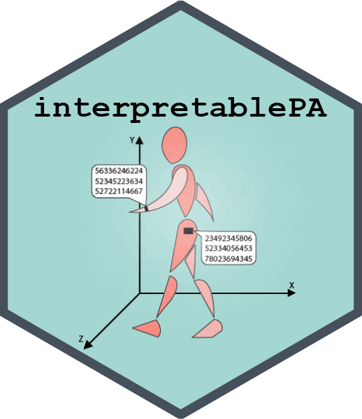

```{r, include = FALSE, echo=FALSE}
knitr::opts_chunk$set(
  collapse = TRUE,
  comment = "#>"
)

```

### {width="262"}

Making cut-point-free accelerometer metrics interpretable

# **1 Introduction**

Accelerometers have become valuable tools to assess physical activity in research settings as well as clinical practice. Traditional accelerometer metrics that rely on absolute acceleration cut-points have several pitfalls. Alternative accelerometer metrics, namely daily average acceleration (AvAcc) and intensity gradient (IG), are cut-point-free and have been shown to be a viable alternative to traditional metrics. In addition, AvAcc and IG are strongly related to various health outcomes (i.e. body fat content, physical functioning, and cardiorespiratory fitness).

So far, cut-point-free metrics are difficult to interpret. Adequate reference values and a translation into meaningful outcomes were missing. This is about to change now.

This application supports the use of cut-point-free metrics, namely AvAcc and IG, assessed by wrist-worn triaxial accelerometers and calculated over the 24 h day.

`rawacceleration` will turn abstract numbers into understandable information. This will be achieved by the following two steps:

-   classifying the levels of physical activity based on age- and sex-specific reference values

-   translating the cut-point-free accelerometer metrics into meaningful outcomes

-   Reference values come from a population sample of 463 healthy adults aged 20 to 89 years in Switzerland who wore the GENEActiv (sampling frequency \@ 50 Hz) on their non-dominant wrist for up to 14 days (Schwendinger et al., 2023)

`rawacceleration` works with data that were processed using the R-package [GGIR](https://cran.r-project.org/web/packages/GGIR/vignettes/GGIR.html#1_Introduction). It is important that data are processed in a similar manner. For further information about [GGIR](https://cran.r-project.org/web/packages/GGIR/vignettes/GGIR.html#1_Introduction), please see the package vignette.

# 2 Getting started

## **2.1 Installing** `rawacceleration`

To get started with the `rawacceleration` package, you first need to install it. You can do this by running the following code in R:

```{r setup}
install.packages("remotes")
remotes::install_github("FSchwendinger/rawacceleration")
```

After the installation is complete, you can load the package using:

```{load package}
library(rawacceleration)
```

## 2.2 Example call

Once you've loaded the `rawacceleration` package, you can start exploring its capabilities. The package consists of a single function that calls a Shiny application. To see this in action, simply run the following code:

```{example}
rawaccel()
```

## 2.3 Accessing `rawacceleration` outside of R and RStudio

The Shiny application included in the package can alternatively be accessed directly through the following website: ***tba***

# 3 How to use `rawacceleration`

The `rawacceleration` package provides a user-friendly application for analysing physical activity data. This application offers several data entry options, including individual-level data, aggregated cohort-level data stratified by sex or non-stratified (cohort means/medians), or raw-level data.

Once all required data have been entered and the calculations have been triggered, the results will be provided in a separate panel (panel "**2) View results**"). For the first two data entry options, our percentile curves presented in the manuscript will be plotted. The user's data will be shown in the plot together with the exact percentiles.

In addition to the percentile curves, the application provides several other options for exploring the results:

-   How much time in different types of activity is necessary for the individual or cohort to reach the 50th percentile? If they are already above the 50th percentile, how much time is necessary to increase their physical activity by 5%?

-   How much average acceleration and intensity gradient need to be increased to correspond to a clinically relevant increase in cardiorespiratory fitness?

-   How much average acceleration and intensity gradient need to be increased to correspond to a relevant reduction in mortality and cardiovascular disease risk?

These options are presented in a separate panel and provide valuable insights into the data and the implications of the results. With this application, users can easily analyse their physical activity data and get the most out of it.

## 3.1 Which parameters should be used?

The reference values deposited in `rawacceleration` are based on the output of [**part 2**](https://cran.r-project.org/web/packages/GGIR/vignettes/GGIR.html#41_Output_part_2) generated by the R-package GGIR.

| Name in GGIR                 | Short description                              |
|------------------------------|------------------------------------------------|
| `AD_ig_gradient_ENMO_0.24hr` | Intensity gradient (IG) across a 24 h day      |
| `AD_mean_ENMO_mg_0.24hr`     | Average acceleration (AvAcc) across a 24 h day |

: GGIR variable names

## 3.2 Individual-level and cohort-level data

### Data entry

Whether you are interested in comparing individual-level or group-level data (i.e. results of your or any other study reporting average acceleration and/or intensity gradient) to our reference values and translate them into understandable outcomes, our application makes this possible.

Options under panel "**1) User data**":

-   Individual-level data: Select this if you have data of an individual.

-   Group-level data: Select this if you have aggregated data of e.g. a study. There are options for sex-stratified data and non-stratified data (data of males and females combined).

Before entering new data and initiating another calculation, do not forget to use the "Reset calculations" button.

### Graphical output

Percentile plots for intensity gradient and average acceleration stratified by sex and age will be produced in panel "**2) View results**" for any of the above described data entry options after pressing "Calculate" (see Figure below). Furthermore, the exact percentiles for the individual or group will be provided. The plots can be downloaded using the "Download" button.

.png){width="466"}

### Translation of results

This section is divided into three panels. Panel 1 is based on average acceleration and shows the time in different activities per day necessary for an individual or a group (depending on the user input) to reach the 50th percentile. In case an individual or a group is already more active than the 50th percentile, the panel shows the time necessary to increase the activity level by 5%. The available activities are:

-   slow walking (3 kph; 80 m*g*)

-   brisk walking (5 kph; 175 m*g*)

-   fast walking (6.5 kph; 400 m*g*)

-   slow running (8 kph; 750 m*g*)

-   moderate running (10 kph; 1000 m*g*)

-   customisable input of acceleration (x m*g*)

Moreover, it is possible to combine two types of activities such as brisk walking and moderate running. The necessary improvement in average acceleration will then be equally divided between the two activities.

Panel 2 provides information on the association between cut-point-free accelerometer metrics and clinically relevant improvements in cardiorespiratory fitness. It shows the necessary absolute change in average acceleration or intensity gradient per day that corresponds to a clinically relevant improvement in cardiorespiratory fitness measured as VO~2max~ (1 mL/kg/min). Note that this association is based on cross-sectional data. Hence, no causation can be implied.

Panel 3 aims to inform about how changes in the level of physical activity may modify the risk of death and disease. It again shows the daily duration of the aforementioned activities that may correspond to a 5.2% lower all-cause mortality. These calculations are based on the association of average acceleration with all-cause mortality in inactive adults. This part is based on findings of @Rowlands2021.

## 3.3 Raw-level data

This data entry option will allow you to paste data of e.g. your study participants or patients in our .csv template and upload it to `rawacceleration`for further processing.

! Important: To avoid errors when processing the uploaded .csv file make sure the file does not include empty rows. Missing data should be denoted as 'NA'. The file needs to be comma-separated. Do not use semicolons. Sex needs to be coded as males = m, females = f.

Choosing the raw-level data entry option will yield the following outcomes.

### Numeric output

+--------------------+----------------------------------------------------------------------------------------------------------------------------------+
| Outcome parameters | Description                                                                                                                      |
+====================+==================================================================================================================================+
| `cent50_ig`        | The exact intensity gradient and average acceleration value corresponding to the 50th percentile for the respective sex and age. |
|                    |                                                                                                                                  |
| `cent50_avacc`     |                                                                                                                                  |
+--------------------+----------------------------------------------------------------------------------------------------------------------------------+
| `ig_perc_pred`     | Intensity gradient and average acceleration as percentage of the predicted value.                                                |
|                    |                                                                                                                                  |
| `avacc_perc_pred`  |                                                                                                                                  |
+--------------------+----------------------------------------------------------------------------------------------------------------------------------+
| `ig_z`             | Corresponding z-scores for intensity gradient and average acceleration.                                                          |
|                    |                                                                                                                                  |
| `avacc_z`          |                                                                                                                                  |
+--------------------+----------------------------------------------------------------------------------------------------------------------------------+

: Raw-level data output

### Graphical output

Moreover, a four-panel graph will be produced with all individual data of intensity gradient and average acceleration provided by the user in relation to our reference values. The graph is stratified by sex and age and can be downloaded in panel "**2) View results**".

# 4 Perspective

We plan on implementing several features in the future.

-   Additional reference value modules for children and adolescents as well as for other geographical regions.

-   Customisable activity goals: We aim to include a field where the user can enter the desired activity level (i.e. an improvement of x%, an absolute improvement of x units, or a clinically relevant improvement in average acceleration or intensity gradient).

-   Downloadable .pdf reports of your analyses: We are currently working on this.

# 5 Methodological considerations

## Raw data processing

To ensure good comparability of your data to our reference values, it is important that data are processed in GGIR in a similar manner. A file containing all GGIR configurations is available here.

## Sampling frequency and wear location

Our Swiss reference values are based on data collected using the GENEActiv (sampling frequency \@ 50 Hz) on the non-dominant wrist. Although the most commonly used accelerometer brands may be comparable (GENEActiv, Movisens Move4, ActiGraph GT3X+, and Axivity AX3) (@migueles2022), large differences in sampling frequency may impact comparability to our reference values (@small2021). The sampling frequency your data were collected with should thus be kept in mind when interpreting the output of our application. There are some algorithms available that may be helpful in this respect (@small2021).

# 6 Citing `rawacceleration`

`rawacceleration` is made available under CC-BY licence. Please refer to the original study when using this package/application in publications or elsewhere:

Schwendinger F., Wagner J., Knaier R., Infanger D., Rowlands A., Hinrichs T., & Schmidt-Trucksaess A. (2023). Reference values for cut-point-free and traditional accelerometer metrics and associations with cardiorespiratory fitness: a cross-sectional study of healthy adults aged 20 to 89 years. medRxiv. doi: ...

### 

### Acknowledgements

The `rawacceleration` logo was created using a pictogram from www.smart-servier.com.

# 7 References
