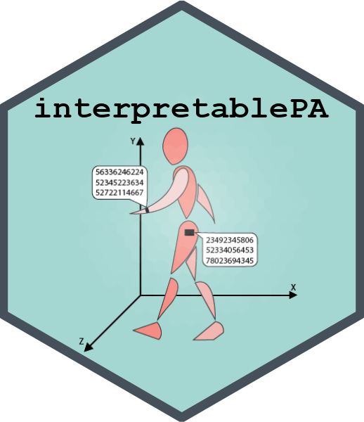

```{r, include = FALSE}
knitr::opts_chunk$set(
  collapse = TRUE,
  comment = "#>"
)
```

{width="262"}

Making cut-point-free accelerometer metrics interpretable

## Overview

The `interpret.pa.centiles()` function from the **interpretablePA** package allows users to compare an individual's physical activity (PA) metrics to population-based reference data using **centiles** for:

-   **Average acceleration (AvAcc)**

-   **Intensity gradient (IG)**

The function produces a **CSV output** with centile estimates, and **four high-resolution plots** illustrating the distributions and relationships of AvAcc and IG.

## Reference datasets

Three internal reference datasets are supported:

-   **Fairclough et al. (2023)**: Children/adolescents age 5-15.

-   **Rowlands et al. (2025)**: Adults, UK Biobank age 40-80.

-   **Schwendinger et al. (2025)**: Adults, NHANES age 20-90.

## Usage example

### Input files

-   **part2_summary.csv**: GGIR Part 2 summary output (required)

-   **subject_data.csv or .xls or xlsx**: Optional file with age, sex, ID (if not in part 2 file)

### Example code

```{r example code, eval=FALSE}
library(interpretablePA)

# Run with only part2 file (subject data in part2).
# Without output_path you are asked to choose a folder (otherwise Downloads is used).
interpretablePA::interpret.pa.centiles(
  part2_path = "data/part2_summary.csv",
  reference_set = "nhanes"
)

# Run with external subject data
interpretablePA::interpret.pa.centiles(
  dat_path = "data/subject_data.csv",
  part2_path = "data/part2_summary.csv",
  reference_set = "rowlands",
  col_avacc = "custom_avacc_column",
  col_ig = "custom_ig_column"
)

# Full example call
interpretablePA::interpret.pa.centiles(
  dat_path =  "PATH_TO_FILE/participant_characteristics.xlsx",
  part2_path = "PATH_TO_GGIR_PART2_FILE/part2_summary.csv",
  output_path = "PATH_TO_OUTPUT_DIR/",
  col_id = "ID",
  col_sex = "sex",
  col_age = "age",
  sex_code_male = "0",
  sex_code_female = "1",
  reference_set = "rowlands",
  col_avacc = "AD_mean_ENMO_mg_0.24hr",
  col_ig = "AD_ig_gradient_ENMO_0.24hr"
)
```

### Example with simulated data

```{r example simulated data, eval = FALSE, warning=FALSE, error=FALSE}


set.seed(123)

# Create a temporary working directory
tdir <- tempdir()
csv_path <- file.path(tdir, "sim_part2_summary.csv")

# Simulate a small dataset
sim_data <- data.frame(
  ID = sprintf("P%03d", 1:10),
  sex = sample(c("0", "1"), 10, replace = TRUE),
  age = sample(20:60, 10, replace = TRUE),
  AD_mean_ENMO_mg_0.24hr = runif(10, 20, 40),
  AD_ig_gradient_ENMO_0.24hr = runif(10, -2.9, -2.3)
)

# Save simulated data
write.csv(sim_data, csv_path, row.names = FALSE)

# Run the function with simulated data (results go to a new subfolder of tdir)
results <- interpretablePA::interpret.pa.centiles(
  part2_path = csv_path,
  output_path = tdir,
  col_id = "ID",
  col_sex = "sex",
  col_age = "age",
  sex_code_male = "0",
  sex_code_female = "1",
  reference_set = "nhanes",
  col_avacc = "AD_mean_ENMO_mg_0.24hr",
  col_ig = "AD_ig_gradient_ENMO_0.24hr"
)

# Show output
head(results)

```

## Output

Each run creates a new folder `interpretablePA_centiles_<reference_set>_<date>_<time>` inside `output_path`. If `output_path` is not given, you are asked to choose a folder (in RStudio or on Windows); otherwise the results go to your Downloads folder.

### Data output

The CSV (`centile_results.csv`) contains:

-   **ID, sex, age**

-   **avacc, ig**: Raw values from GGIR output

-   **avacc_centile, ig_centile**: Character descriptions (e.g., "above 95th percentile")

-   **avacc_centile_num, ig_centile_num**: Numeric centiles for plotting

-   **age_warning**: Notes if participant age is outside reference range

### Plot output

Four PNG plots are saved:

1.  **AvAcc Centile Distribution**

2.  **IG Centile Distribution**

3.  **AvAcc Centile vs Age**

4.  **IG Centile vs Age**

All plots are saved at **400 DPI** in the same folder as the output CSV. Only participants with a numeric centile are plotted; the plot subtitles state how many were below or above the reference range, outside the age range, or had missing data. A plot is skipped if no participant can be plotted.

## Methods

-   Centiles are computed via **linear interpolation**: the reference centile curves are interpolated at the participant's exact age, and the participant's value is interpolated between the centiles.

-   If participant age is outside the reference's valid range, the centile is not estimated (reported as "age out of range").

-   Participants with missing data (age, sex, AvAcc or IG) are retained with `NA` for the affected metric. If a separate subject file is used, participants without GGIR data are kept with `NA`, and a warning lists IDs that appear in only one of the two files.

## Citing reference sets

Depending on the selected reference set, please cite the following sources:

### Fairclough et al. reference

Fairclough S.J., Rowlands A.V., del Pozo Cruz B., Crotti M., Foweather L., Graves L.E.F., Hurter L., Jones O., MacDonald M., McCann D.A., Miller C., Noonan R.J., Owen M.B., Rudd J.R., Taylor S.L., Tyler R., Boddy L.M. (2023). Reference values for wrist-worn accelerometer physical activity metrics in England children and adolescents. *International Journal of Behavioral Nutrition and Physical Activity*, 20(1), 35.
<https://doi.org/10.1186/s12966-023-01435-z>

### Rowlands et al. reference

Rowlands A.V., Kingsnorth A.P., Hansen B.H., Fairclough S.J., Boddy L.M., Maylor B.D., Eckmann H.R., del Pozo Cruz B., Dawkins N.P., Razieh C., Khunti K., Zaccardi F., Yates T. (2025). Enhancing clinical and public health interpretation of accelerometer-assessed physical activity with age-referenced values based on UK Biobank data. *Journal of Sport and Health Science*, 14, 100977. <https://doi.org/10.1016/j.jshs.2024.100977>

### NHANES reference

Schwendinger F., Infanger D., Lichtenstein E., Hinrichs T., Knaier R., Rowlands A.V., Schmidt-Trucksäss A. (2025). Intensity or volume: the role of physical activity in longevity. *European Journal of Preventive Cardiology*, 32(1):10–19. <https://doi.org/10.1093/eurjpc/zwae295>

### General package reference

Schwendinger F., Wagner J., Knaier R., Infanger D., Rowlands A.V., Hinrichs T., & Schmidt-Trucksäss A. (2024). Accelerometer Metrics: Healthy Adult Reference Values, Associations with Cardiorespiratory Fitness, and Clinical Implications. *Medicine and Science in Sports and Exercise*, 56(2):170–180. <https://doi.org/10.1249/MSS.0000000000003299>

## Learn more

See the documentation:

```{r reference to documentation, eval = FALSE}
?interpret.pa.centiles
```
